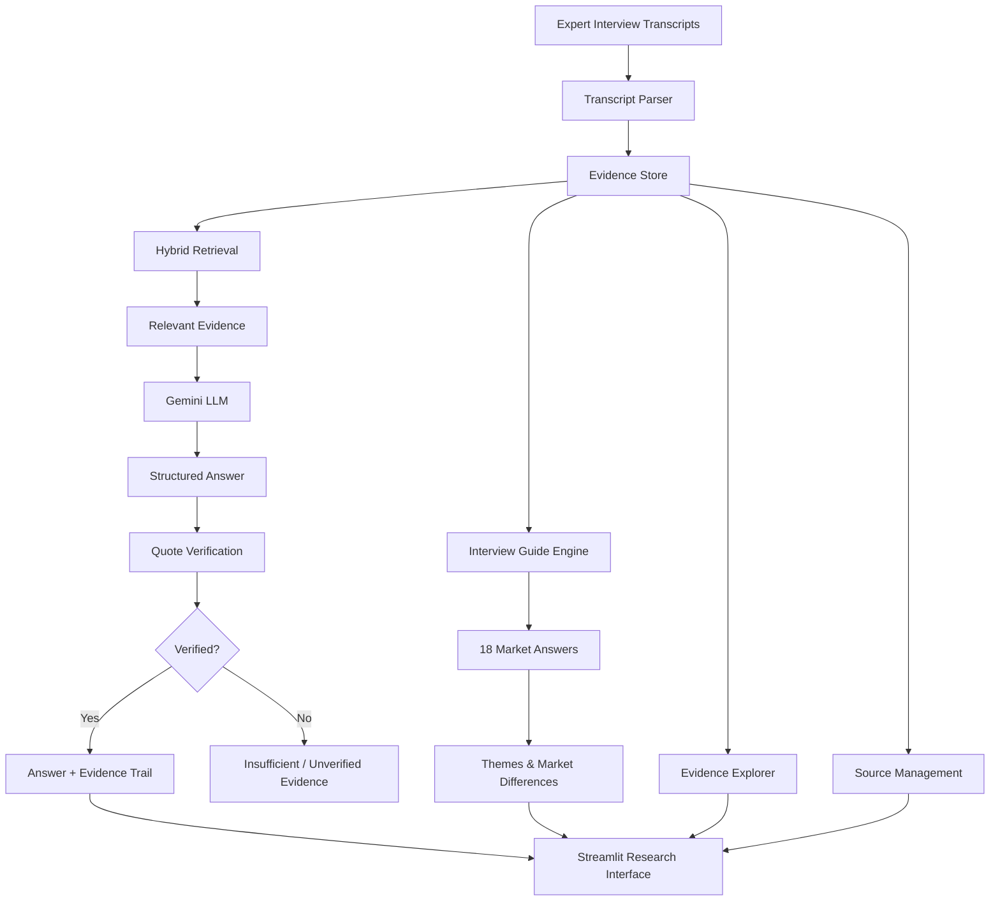

# Hasamex Research Intelligence

An evidence-first AI research assistant for analyzing expert interviews about robotic surgery adoption across France, Germany, and the United Kingdom.

The system converts raw interview transcripts into:

- Structured interview-guide answers
- Cross-market comparisons
- Common themes and market differences
- Evidence-backed natural-language answers
- Exact transcript quotes
- Expert, market, and timestamp citations
- Quote-level verification
- Transcript ingestion and inspection

## Core Idea

The system follows an evidence-first pipeline:

```text
Question
   ↓
Retrieval
   ↓
Relevant Evidence
   ↓
LLM Synthesis
   ↓
Quote Verification
   ↓
Evidence-backed Answer
```

The LLM is used for synthesis, not as the source of truth.

Every generated quote shown as verified must exist in the original transcript evidence.

If the available transcripts do not support an answer, the system does not invent one.

---

## Application

### 1. Overview

Provides a high-level view of the research dataset and generated outputs:

- Number of markets
- Number of experts
- Interview-guide questions
- Verified answers
- Research themes
- Market differences

### 2. Interview Guide

Answers the six predefined research questions across:

- France
- Germany
- United Kingdom

Each answer includes its supporting evidence.

### 3. Compare Markets

Allows the same research question to be compared across multiple markets.

Each market displays:

- Synthesized answer
- Supporting evidence
- Expert
- Market
- Timestamp
- Evidence ID
- Verification status

### 4. Themes & Disagreements

Identifies:

- Common themes across markets
- Market-level differences
- Supporting evidence

This provides a cross-market research layer beyond individual transcript summaries.

### 5. Evidence Explorer

Allows inspection of the underlying transcript evidence and source records.

### 6. Ask the Research Assistant

Users can ask new questions across the expert interviews.

The system retrieves relevant transcript evidence before generating an answer.

Example:

> What are the main barriers to robotic surgery adoption?

The result contains:

- AI synthesis
- Verified evidence
- Exact quotes
- Expert
- Market
- Timestamp
- Evidence ID

Unsupported questions are rejected when the generated answer cannot be verified against the source evidence.

### 7. Source Management

Displays:

- Loaded transcripts
- Transcript records
- Expert statements
- Markets
- Transcript previews
- Upload interface for additional TXT transcripts

---

## Architecture



---

## Evidence-First Design

The main reliability mechanism uses two layers.

### Layer 1 — Retrieval Grounding

The LLM receives only the evidence retrieved from the transcript store.

The prompt instructs the model to:

- Use only supplied evidence
- Avoid outside knowledge
- Avoid unsupported inference
- Copy quotes exactly
- Return structured evidence references

### Layer 2 — Programmatic Quote Verification

Generated quotes are checked against the original transcript evidence.

```text
Generated Quote
      ↓
Find Evidence ID
      ↓
Normalize Text
      ↓
Check Exact Quote
      ↓
Verified / Rejected
```

A quote that cannot be found in the original evidence is not displayed as verified.

This provides a code-level guardrail instead of relying only on prompt instructions.

---

## Retrieval

The retrieval layer combines:

- Keyword/topic signals
- TF-IDF similarity
- Topic-aware scoring
- Reranking

This improves retrieval for research questions where the exact wording of the question differs from the transcript wording.

The architecture is intentionally modular so the retrieval layer can later be extended with vector search for larger datasets.

---

## Current Research Dataset

| Item | Count |
|---|---:|
| Markets | 3 |
| Experts | 3 |
| Transcript records | 42 |
| Expert statements | 21 |
| Interview questions | 6 |
| Market-level answers | 18 |
| Common themes | 3 |
| Market differences | 3 |

Markets:

- France
- Germany
- United Kingdom

---

## Project Structure

```text
hasamex-ai-case-study/
│
├── app/
│   ├── models.py
│   ├── parser.py
│   ├── evidence_store.py
│   ├── guide.py
│   ├── guide_engine.py
│   ├── topic_map.py
│   ├── retrieval.py
│   ├── hybrid_retrieval.py
│   ├── reranker.py
│   ├── quote_verifier.py
│   ├── llm_synthesis.py
│   ├── theme_engine.py
│   └── ...
│
├── data/
│   ├── Interview_Guide.txt
│   ├── Transcript_1_France.txt
│   ├── Transcript_2_Germany.txt
│   ├── Transcript_3_UK.txt
│   ├── guide_answers.json
│   └── themes.json
│
│
├── app.py
├── requirements.txt
├── README.md
└── .gitignore
```

---

## Setup

### 1. Create the virtual environment

```powershell
python -m venv .venv
```

### 2. Activate it

```powershell
.venv\Scripts\Activate.ps1
```

### 3. Install dependencies

```powershell
pip install -r requirements.txt
```

### 4. Configure Gemini

Set the API key as an environment variable.

PowerShell:

```powershell
$env:GEMINI_API_KEY="YOUR_API_KEY"
```

Do not commit the API key to GitHub.

---

## Generate Research Outputs

Generate the interview-guide answers:

```powershell
python -m app.guide_engine
```

Generate themes and market differences:

```powershell
python -m app.theme_engine
```

---

## Run the Application

```powershell
streamlit run app.py
```

Then open the local Streamlit URL shown in the terminal.

---

## Example Research Questions

```text
What are the main barriers to robotic surgery adoption?

How important is ROI in hospital purchasing decisions?

How does surgeon training affect adoption?

What are the expected adoption trends?

How long does procurement typically take?
```

---

## Hallucination Test

The application should not invent information that does not exist in the transcripts.

For example:

```text
What is the market share of robotic surgery manufacturers in France?
```

If the transcripts do not contain supporting evidence, the system should return an insufficient/unverified result rather than inventing a market-share figure.

---

## Scaling

The current dataset contains three transcripts, but the architecture separates:

- Ingestion
- Parsing
- Evidence storage
- Retrieval
- Synthesis
- Verification
- Presentation

For 30+ transcripts, the retrieval layer can be extended with a vector database such as Chroma or pgvector while preserving the same evidence metadata:

```text
evidence_id
expert
role
market
timestamp
source
text
```

This allows retrieved chunks to remain traceable to their original source.

---

## AI Disclosure

AI tools were used during development for implementation assistance and debugging.

The system design, evidence pipeline, retrieval logic, verification mechanism, research outputs, and application behavior are intended to be understood and explainable by the developer.

---

## Design Principle

The central design principle is:

> The model synthesizes the evidence. The evidence remains the source of truth.
